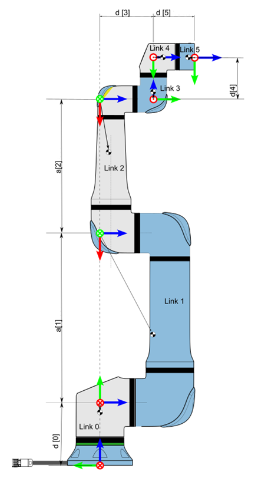
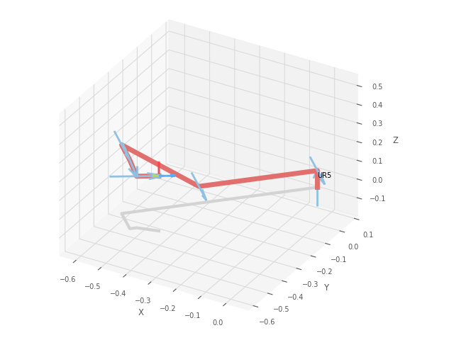
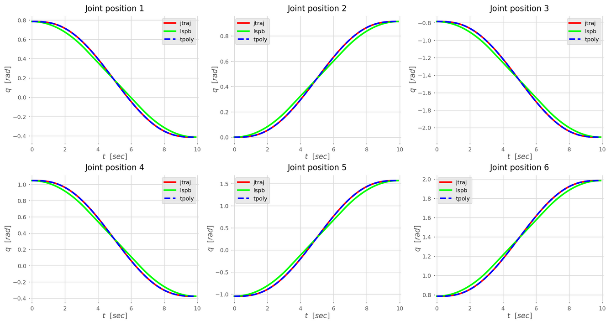

### Second laboratory work for course Robot Motion Planning and Control.

#### Robotic Arm Used - UR5 (from Universal Robots)

<table align="center">
  <tr>
    <td></td>
  </tr>
</table>

 <table>
  <tr>
    <td>Joint Space Trajectory</td>
    <td>Linear Segment with Parabolic Blend (LSPB)</td>
    <td>Quintic Polynomial Interpolation</td>
  </tr>
  <tr>
    <td></td>
    <td></td>
    <td></td>
  </tr>
  <tr>
    <td>jtraj Method</td>
    <td>mtraj method with the trapezoidal function</td>
    <td>mtraj method with the quantic function</td>
  </tr>
</table>
 

#### Joint Position/Velocity/Acceleration Profile of UR5 Robotic Arm

<table>
  <tr>
    <td>Joint Positions</td>
    <td>Joint Velocities</td>
    <td>Joint Accelerations</td>
  </tr>
  <tr>
    <td></td>
    <td></td>
    <td></td>
  </tr>
</table>

### Tasks:
1. Load the manipulator model from the toolbox according to the selected robot kinematics option. Fill in all parameters of the robot model as specified in Laboratory Work No. 1.
2. Fill in all parameters of the robot model as specified in Laboratory Work No. 1.
3. Set an arbitrary initial robot configuration.
4. Solve the forward kinematics problem for the given generalized coordinates.
5. Construct the manipulator's workspace under the given joint constraints.
6. Select an end point within the workspace and solve the inverse kinematics problem for it.
7. Plan the trajectory between the initial and final positions of the manipulator's end-effector using at least three planning methods.
8. Plot graphs of position, velocity, and acceleration of the robot's joints during trajectory motion.
9. Prepare a report in .ipynb format with detailed comments. 
10. Conclusions should be drawn based on the results of the work.
